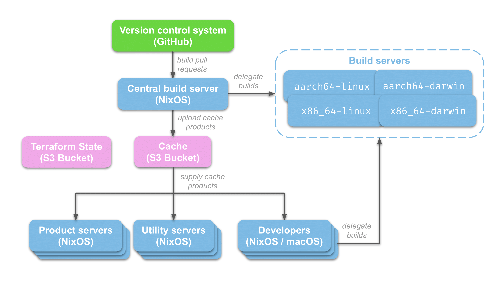

# A real-world NixOS architecture

In the previous chapter we deployed a standalone web server and that would likely be good enough for a small business or organization.  However, if you're planning to use NixOS within a larger organization you're probably going to need more supporting infrastructure to scale out development.

The following diagram shows a more complete NixOS architecture that we will cover in this chapter:

{width: "100%"}

… and this chapter will include a sample Terraform template and instructions you can use for deploying this architecture diagram.

The ["big picture"](#big-picture-architecture) chapter briefly introduced these architectural components, but we'll cover them in more detail here.

## Product servers

These servers are the "business end" of your organization so we obviously can't omit them from our architecture diagram!  For our running example, we will have just one product server that runs our TODO web application.

These product server are going to be NixOS servers, which could be virtual machines hosted by a cloud provider or physical servers in your organization's datacenter (See: [Virtualization](#virtualization)).  Either way, we're going to run and manage product-related services `systemd` services managed by NixOS.

For this chapter, we're assuming that these product servers are hosted within your cloud provider or data center (i.e. "SaaS") and not hosted by one of your customers (See: [On-premises vs. Software as a service](#on-off-prem)).  We'll cover "on-prem" deployments in a subsequent chapter.

## Version control system

Software development organizations of all sizes use some form of version control (most commonly `git`) and typically also a supporting platform (e.g. GitHub).  In our running example we'll be using GitHub as our version control platform so that we can make use of the following features:

- *hosting a `git` repository*

  This is the bare minimum that we expect from a version control platform.  We need some place to host our `git` repository that all our developers (and build servers!) can easily access.  For proprietary code the repository should also support some form of access control.

- *pull requests*

  We will use [pull requests](https://docs.github.com/en/pull-requests/collaborating-with-pull-requests/proposing-changes-to-your-work-with-pull-requests/about-pull-requests) as our change management system to propose changes and solicit approvals from other developers.

  Version control platforms sometimes support a notion of [code owners](https://docs.github.com/en/repositories/managing-your-repositorys-settings-and-features/customizing-your-repository/about-code-owners) which allow you to specify which developers own different files within a repository in order to notify them of relevant pull requests and/or require their approval for changes to files they own.

- *continuous integration*

  We might want to prevent people from merging changes to the main development branch unless they pass certain criteria.  Those criteria might include automated tests passing, obtaining a certain number of approvals, or successfully uploading build products to a cache.

## Central build server

We'll need a central build server if want to build our software and run tests on every pull request.  Since successful builds/tests will gate merge you want this build server to be highly reliable otherwise development will grind to a standstill if the server goes down.  Even better, you should probably have a "hot spare" server ready for use as a backup if the main build server fails, but that won't be covered in this book.

{blurb, class:information}
Remember that Nix builds also include tests, so whichever servers perform builds also run tests, too.  So throughout this chapter I'll use the term "builds" as a short-hand for "builds and tests".  See also: [The Zen of NixOS](#zen).
{/blurb}

In the complete architecture, this central build server (the "hub") only *initiates* builds using Nix's support for [remote builds](https://nixos.org/manual/nix/stable/advanced-topics/distributed-builds.html) but the actual builds are carried out by separate build servers for each supported platform (the "spokes").  In a simpler version of this architecture you might be able to get away with just a hub and no spokes if you only need to build for one platform.

You might wonder why we even need the central build server at all.  In theory we could initiate the builds directly on the spokes without going through an intermediate build server.

However, there are a few important advantages to initiating all builds on a central server:

- *cache coherence*

  If you initiate all builds on the hub then you never perform the same build twice so long as the first build remains cached.  In contrast, if you initiate builds directly on the spokes then the same build product could be built multiple times if you have multiple spokes building products for the same platform.

- *avoiding duplicate work*

  Nix can avoid initiating a build if there is another matching build already in progress.  However, this only works if both builds are initiated on the same machine; otherwise there's no way for multiple machines to coordinate their builds to avoid wasted work.

- *better resource utilization*

  A hub can make use of spare build capacity across all available spokes, so a particularly expensive build (e.g. a change that upgrades multiple dependencies) can be powered by a large number of spokes.  In contrast, confining each build to a single spoke means that spokes have to be over-provisioned and often most of their build capacity sits idle.

- *heterogeneous builders*

  Nix's support for remote builds comes in handy if you want to make use of different builder hardware profiles.  In other words, you may want to delegate some types of builds (e.g. NixOS tests) to memory-optimized machines and other types of builds (e.g. expensive builds like `chromium` or the Linux kernel) to CPU-optimized machines.  Remote builds make it much easier to support these sort of heterogeneous build architectures.

## Build servers

You'll need to supplement the central build server (the hub) with satellite
build servers (the spokes) if you want to be able to build products for more
than one platform.

There is one special case where you don't need spokes: if you only require
build products for the same platform as your central build server.  For example,
if your central build server is an `x86_64-linux` NixOS machine and all of your
other machines (including developer machines) share the same `x86_64-linux`
platform then you can build all build products on the hub and skip the spokes.

However, this scenario is not that common because you usually have to support
more than one platform, such as macOS laptops for developers (e.g.
`x86_64-darwin` for Intel Macs or `aarch64-darwin` for M1 Macs) or even multiple
Linux platforms (e.g. `x86_64-linux` and `aarch64-linux`).  So you should
budget the time and money to set up spokes as part of your NixOS infrastructure.

There's another reason you want to set up satellite build machines: developers
can make use of them, too!  You can allocate spare build slots or even reserve
entire machines for developers to use for remote builds, which comes in handy
for two reasons:

- *accelerating builds*

  A developer might want to offload an expensive build (or set of builds) to a
  much more powerful machine, both to speed up the build and also reduce the
  computational load on their local machine.

- *creating/debugging build products for other platforms*

  For example, one of your developers might use a macOS development machine, but
  need to reproduce a Linux build that failed in CI.  Or, vice versa, a
  developer using Linux might need to reproduce a failed macOS build.  Granting
  them access to a remote build machine for the appropriate platform can help
  them reproduce builds for all supported platforms.

{blurb, class:information}
Note: macOS developers can in some cases build Linux build products locally
using the Nixpkgs support for local Darwin builders on Linux.  Revisit the
[macOS-specific setup instructions](#macos-instructions) from the
[Setting up your development environment](#setup) chapter for more details.

However, this only works for Linux build products that share the same
architecture (e.g. building `aarch64-linux` build products on an
`aarch64-darwin` machine).
{/blurb}
