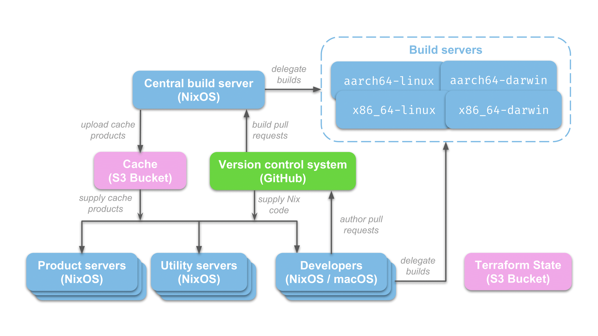

# A real-world NixOS architecture

In the previous chapter we deployed a standalone web server and that would likely be good enough for a small business or organization.  However, if you're planning to use NixOS within a larger organization you're probably going to need more supporting infrastructure to scale out development.

The following diagram shows a more complete NixOS architecture that we will cover in this chapter:

… and this chapter will include a sample Terraform template you can use for deploying this architecture diagram.

The ["big picture"](#big-picture-architecture) chapter briefly introduced these architectural components, but we'll cover them in more detail here.

## Product servers

These servers are the "business end" of your organization so we obviously can't omit them from our architecture diagram!  For our running example, we will have just one product server that runs our TODO web application.

These product server are going to be NixOS servers, which could be virtual machines hosted by a cloud provider or physical servers in your organization's datacenter (See: [Virtualization](#virtualization)).  Either way, we're going to run and manage product-related services directly using NixOS as `systemd` services.

For this chapter, we're assuming that these product servers are hosted within your cloud provider or data center and not hosted by one of your customers (See: [On-premises vs. Software as a service](#on-off-prem)).  We'll cover the latter type of deployments ("on-premises") in a subsequent chapter.

One important requirement for product servers is the 

## Utility servers
